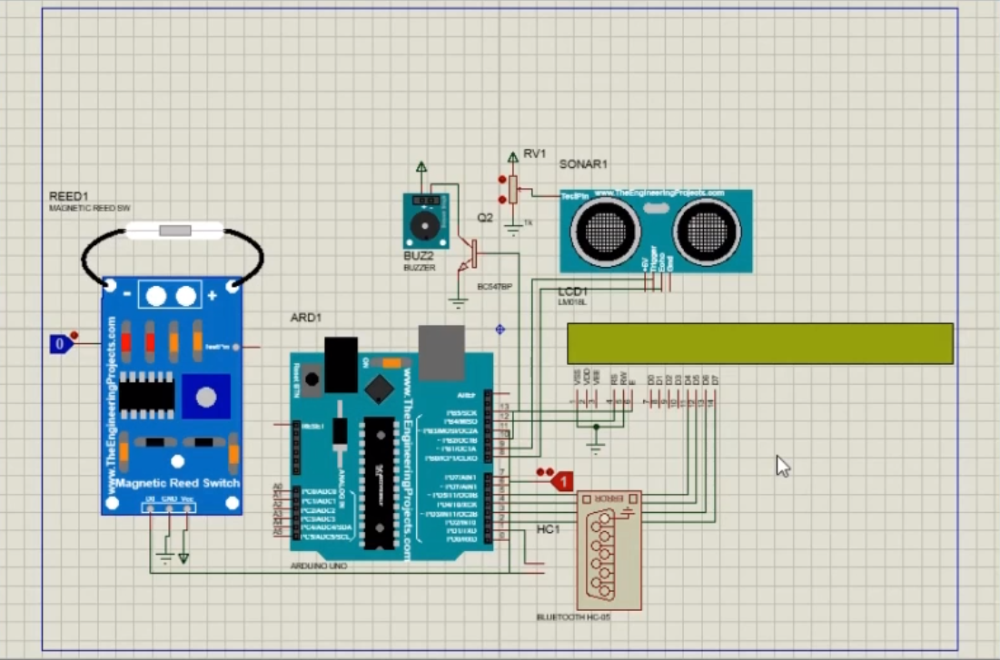
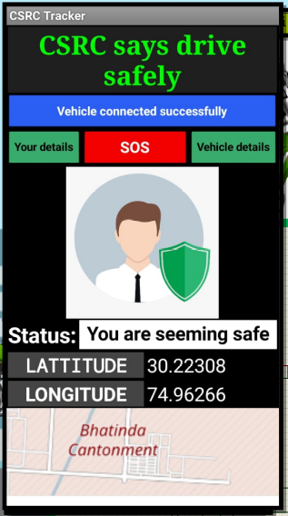

# IoT Based Automated Traffic Control System

The GitHub Repository of Team NODEzilla for X-IoT-A 2021, an IoT event conducted in Udyam, IIT (BHU) Varanasi, where we bagged second position.

## Problem Statement we proposed

Overspeeding and rash driving is a major issue in our country which leads to many major road accidents. We chose to improve this condition by designing an automated internet of things based solution for this.

## What we designed 

- We designed an electronic system which consisting of arduino micro-controller, bluetooth module and various sensors. This electronic system can be installed in the vehicle which will provide us vehicle details like its speed. You can see the proteus simulation in the image below

- We designed an android app on [MIT App Inventor](https://appinventor.mit.edu/) which will be installed on driver's mobile phone. This app will be connected to the vehicle via bluetooth and will get notified whenever vehicle's speed exceeds the speed limit. You can see a snap of the app below

## How it works

Whenever the micro-controller detects overspeeding, it displays a warning on the display and notifies the app also. When the driver see the notification on display and can heer the continuous beep, he can bring his speed within limit. But, if after sometime there's no change in the speed, the app messages the traffic police authorities and provide them the details of vehicle and driver.

The app also has SOS feature which can be used by driver to contact police authorities in case of road emergencies.

This was our overall project for the event. Simulation explanation video is [here](https://drive.google.com/file/d/14JcoLLE8V8_LEhRiyUDocJth_10loPWa/view?usp=sharing)

## Team

<table>
	<td align="center">
     <a href="https://github.com/phoenixrider12">
     <b>Aryaman Gupta</b></a> 
	</td>
 <td align="center">
     <a href="https://github.com/Ankur-Agrawal-ece20">
     <b>Ankur Agrawal</b></a> 
    </td>
<td align="center">
     <a href="https://github.com/SanidhyaTaparia">
     <b>Sanidhya Taparia</b></a> 
	</td>
</table>
